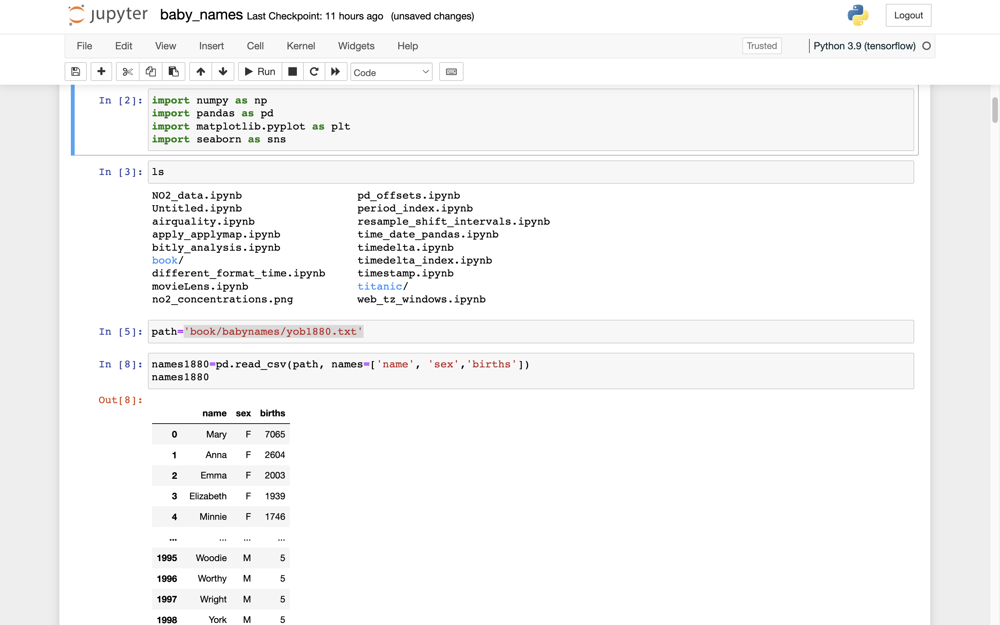

# baby-names-analysis

This research will analyze the frequency of infant names from 1880 to 2010 based on a Social Security Administration dataset. Using this dataset, I have performed a variety of tasks.
- Display the percentage of infants who have been given a certain name throughout time.
- Determine the relative rank of a name. 
- Identify the most popular names in each year or the names whose popularity has increased or decreased the most.
- Analyzed the following patterns in names: vowels, consonants, length, general variety, change in spelling, initial and final letters.
- Analyze external sources of trends: biblical names, celebrities, demographic shifts

After downloading the "National Data" file names.zip and decompressing it, I have created a directory containing a collection of files such as yob1880.txt.

